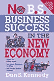
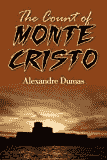
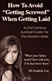
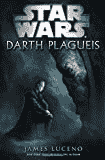
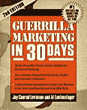
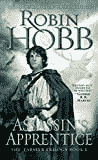
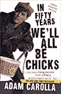
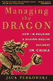
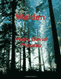

# 我最近读的书——第一部分

> 原文：<https://alphamale20.com/2012/10/27/books-ive-been-reading-lately-part-one/>

每隔一段时间，我会写一篇“我最近读的书”的帖子，在那里我会快速回顾一下过去几个月我读过的一些书。不会是我读过的所有的书。我读了很多书，那会花太多时间，但它会是一些更著名的书。

正如我以前说过的，我总是一次读两本书，一本小说和一本非小说。小说类书籍几乎都是历史小说或奇幻小说，通常带有浓厚的大男子主义色彩。非小说类书籍总是关于商业、成功、哲学、历史或经济学的书籍。我喜欢读书，我的阅读确实是我人生中经历的许多成功的原因，包括小说。

为了反映这种多样性并保持它的趣味性，我会尽最大努力将书评在小说和非小说书籍之间对半分。这应该会给你一个很好的概述。(是的，如果你点击一本书并购买它，我确实可以赚 40 美分左右。如果这激怒了你，我邀请你去读一个不同的博客。)

我会给每本书一至四颗星的评分系统如下:

*   One Star: Stupid, it sucks (at least for me)
*   Two stars: OK, recommended but not wonderful.
*   Three stars: Very good, recommended to everyone.
*   Four Stars: Unbelievable, an absolute must-read.

以下是我在过去几个月读过的一些书，排名不分先后:

[《国王之路》作者布兰登·桑德森](http://www.amazon.com/gp/product/0765365278/ref=as_li_ss_tl?ie=UTF8&tag=theblacblog-20&linkCode=as2&camp=1789&creative=390957&creativeASIN=0765365278)  - 2.5 星

我和幻想作家布兰登·桑德森有着爱恨交加的关系。

从积极的一面来看，他创造的世界比这一类型的任何人都要好。我是认真的。他的世界、魔法系统和场景比你能在那里找到的任何东西都更有创造性。他也非常擅长写动作场面。在桑德森的一本书里读到一场战斗被描述得如此之好，就像在你的脑海里看电影一样。最后，他的情节是经过深思熟虑的。每一根错综复杂的线都编织得很好，而且(通常)解决得很好。

从不好的方面来说，他的角色很糟糕。他们都很沮丧，沮丧，懊悔。当我说“所有”的时候，我真的是指他们所有人。至少是所有的主要角色。《国王之路》是本好书，但它有 1200 页，写的都是沮丧、矛盾的人物。好像那是桑德森唯一知道怎么写的角色类型，真的很蹩脚。

更糟糕的是，桑德森患有“乔治·R·R·马丁病”(也被称为“罗伯特·乔丹病”)，他开始时很棒，但后来*一直写下去，从来没有达到他妈的点*。不要让我开始谈论*时间之轮*或者*权力的游戏*系列。我的意思是，你读这些家伙，他们很棒，但是*几千页*你最终会尖叫“已经几千页了！说重点！”

(嘿，*《权力的游戏》*太棒了。但是 5000 页之后丹妮莉丝·坦格利安**还是**还没有跨过他妈的海洋？伙计。如果你已经读过该系列的第二或第三本书，马丁是在和你开玩笑，你只是在浪费时间。)

《国王之路》可以很容易地有一半的大小，情节不会受到任何影响。像他之前的马丁和乔丹一样，桑德森最终开始写作是为了*永远写下去*，而不是写给*讲一个好故事。*有开头、中间和结尾 *的一种。好故事不会永远曲折。他们结束了！*

我的一个非常低优先级的，只是为了好玩的项目是写一部奇幻小说。我不能像你想象的那样经常做这件事。不管怎样，我已经看了 250 页了。我大胆的猜测是，当我完成的时候，它会有 800 - 900 页，但我写它不是为了填满页面，我写它是为了用我喜欢的那种角色写那种故事，我希望有更多。我希望更多的幻想作家那样做。哦好吧。也许一旦《男性至上》一书出版，我就可以自己出版我的奇幻小说(因为以传统方式出版小说几乎是不可能的)，这样我就可以对四个愿意购买它的人微笑了。

所以*王者之道，*我爱它，也恨它。我的建议是，如果你读过桑德森的其他作品，你可能会喜欢《T2 之路》足以让你觉得值得一读。如果你从未读过布兰登·桑德森的书，那么我的建议是忘掉《T4》中的《国王之道》吧，去读读《迷雾:最终帝国》吧。这是一本更好的书，也是一个更好的系列，但也存在我提到的同样的问题。如果你喜欢出生错误的书，那么在你读完这些书之后，去读《王者之路》。

[新经济中没有商业成功丹·肯尼迪](http://www.amazon.com/gp/product/1599183617/ref=as_li_ss_tl?ie=UTF8&tag=theblacblog-20&linkCode=as2&camp=1789&creative=390957&creativeASIN=1599183617)  - 3 颗星

如果你有自己的生意或者打算很快开始，而你不知道丹·肯尼迪是谁，你需要知道。他是世界上第二伟大的营销头脑。(第一个最伟大的是杰·亚伯拉罕。有史以来最伟大的是加里·赫伯特，但他已经死了。有一天我需要写一篇关于那个人的博客...他是一个真正的人物。)

我利用丹·肯尼迪的营销理念和技术赚了很多钱，也就是在我 20 多岁开始第一次全职创业的时候。当他宣布他正在根据“新经济”编写一本新的商业书籍时，我在场。

当我阅读像这样的一般市场商业书籍时，问题是我通常已经知道至少 50%的内容。我做全职商人快 20 年了，如果算上兼职的话比这还长，所以这是可以理解的。然而，我所需要的是一些我还没有想到的关键概念，或者应用旧技术的新方法。这本书两者都有。我也赞同肯尼迪对“新经济”的总体评价。从本质上说，他说它“永远不会消失”，那些等着它“回到过去的样子”的人是“傻瓜”。差不多吧，是的。

书中的一段关键引文:

即使是在我执掌一家收购不当、深陷困境、资金大量流失、混乱不堪、危机重重的公司时，我也每天至少花一个小时摆脱与鳄鱼的争斗，重新专注于目标，做一些积极、有成效、有目标的事情。

阿门。如果一个人学会了不仅在生意上，而且在生活中运用这一点，不管他有什么缺点或障碍，他都会对自己的成就感到惊讶。我就是活生生的例子。

我对这本书的唯一批评是，肯尼迪，这个曾经的营销者，经常在整本书中打击你去买他的其他东西。嘿，我自己也做过一点。我说*一点点。*我一般不介意这种事情，只要其余的内容非常好，但他有点疯狂。没什么大不了的。(除非你是那种憎恨资本主义的人...哦，妈的，你会*带着炽热的激情恨*丹·肯尼迪。如果你拥有自己的小企业，这将是一个巨大的错误。

如果你有自己的生意，我推荐这本书，特别是如果你有一个有员工的实体企业，如果你已经经营了很长时间，我推荐这本书。好东西。

[《基督山伯爵》作者亚历山大·仲马](http://www.amazon.com/gp/product/1613820976/ref=as_li_ss_tl?ie=UTF8&tag=theblacblog-20&linkCode=as2&camp=1789&creative=390957&creativeASIN=1613820976)  - 4 星

又一本 1200 页的书！耶！这是一个从赤贫到暴富的终极故事，一个从黑暗的地牢到超级富豪的家伙，一心想着对朋友的善意和对敌人的黑暗报复。他是真正的文学头号人物之一。强壮、聪明、狡猾、博学、冷静、冷静、无戏剧性、商业头脑、足智多谋、目标导向、世界旅行家、热情、积极、阳刚。哦，我有没有提到他的女朋友是 18 岁，而他已经 40 多岁了？他告诉她，她可以和其他男人约会，因为他有比照看她的屁股更重要的事情要做？自从《琥珀之歌》的柯文之后，我从未如此关注和欣赏过一个虚构的人物。我完全被他的每一页吸引住了。

我读了这本书的未删节版，但是我喜欢阅读。我认为有一个缩短了 40%的版本。未删节版很棒，但公平地说，这本书在中间的某些部分有些拖沓。需要奉献精神才能通过。如果这听起来不太有趣，但你还是想读一读有钱的男性角色，那就读一下节略版吧。如果你真的想要体验，请阅读完整版。

对我来说，真正有趣的是，这本书和《瓦尔登湖》(我将在下面回顾)以及我一直最喜欢的书之一《T2》、《大班》(由另一位出色的男性主角德克·斯特鲁恩主演)都发生在同一时期，即 19 世纪中叶。*基督山*在欧洲，*瓦尔登湖*在美洲，*大班*在亚洲，都在同一时间。看到交叉对比非常酷。

强烈，强烈推荐。读这本书。

[亨德里克](http://www.amazon.com/gp/product/0615327478/ref=as_li_ss_tl?ie=UTF8&camp=1789&creative=390957&creativeASIN=0615327478&linkCode=as2&tag=theblacblog-20) 如何避免在做爱时被“搞砸”——2.5 颗星

有时我喜欢读代表不同意见的书(我读过帕特·布坎南和迈克尔·摩尔等人的书)，但其他时候我喜欢读与我推荐的观点和方法相同的人写的书。亨德里克实际上是一名律师和前法官，所以他从这个角度写男人的问题，而我缺乏他的法律背景。正是在亨德里克，我第一次了解到“同居协议”，一种与女性同居的婚前协议。非常酷。亨德里克是真正的同道中人。

这本书最精彩的部分是他的案例研究！我最喜欢的故事是一个有着开放婚姻的花瓶妻子欺骗她的男友违反法庭命令，但是还有很多这样的故事。伙计，这些会让你大吃一惊的。很有娱乐性。如果你想知道一些女人有多邪恶，一些男人有多愚蠢，你必须读一读这本书。

詹姆斯·卢塞诺 《星球大战:达斯·瘟疫》——2.5 星

“搞什么鬼？他真的读过《星球大战》小说吗？”是的，我读了一部星球大战小说。如你所知，我读了很多深奥复杂的东西，所以我偶尔可以吃点文学糖果。所以 F U。

我不厌其烦地读这本书的主要原因是:A)它是关于皇帝的，是我在《星球大战》中最喜欢的角色；B)它是由詹姆斯·卢塞诺写的，他是我从小最喜欢的作家之一。对于你们这些和我差不多大的人来说，他是很多年前以“杰克·麦金尼”的名字写了所有机器人技术小说的人。所以当我看到一本关于皇帝的书(！)作者詹姆斯·卢塞诺(！)我内心的童真无法抗拒。

这本书的前半部分很有趣。我喜欢故事聚焦邪恶的角色。所以很少有书做到这一点。R.A. Salvatore 关于刺客 Artemis Enterri 的小说也同样有趣。

这本书的后半部分慢了下来，进入了政治细节，这不像前半部分的黑暗邪恶的东西那么引人注目。所以我推荐这本书，但是轻描淡写。

[30 天游击营销作者杰伊·康拉德·莱文森](http://www.amazon.com/gp/product/1599182661/ref=as_li_ss_tl?ie=UTF8&tag=theblacblog-20&linkCode=as2&camp=1789&creative=390957&creativeASIN=1599182661)  - 2 星

偶尔，我会读这样的书来重新集中注意力，并“完善我”，以确保当我专注于我的商业方法时，我不会忽略或忘记我应该追求的其他方法。这本书是完美的。就像丹·肯尼迪的书一样，很多我已经知道了，但是有一些关键的部分我说“哦，该死！当然！”然后我做了一个书面笔记，坚持阅读，并在后来整理我的笔记，以便整合到我的商业行动计划中(这是我在阅读非小说时总是做的)。

我推荐这本书，尤其是如果你是营销新手的话。杰伊·康拉德·莱文森是营销专业的坚定支持者，这本书是一本很好的入门书。即使你非常有营销经验，这也是一本“一英里宽一英尺深”的书，它真的会迫使你抓住所有你应该花时间关注的不同领域。莱文森的“营销日历”方法本身就值这本书的价格。

罗宾·霍布斯的《刺客学徒》  - 1 星

因为这该死的书，我现在胸口还疼。真是浪费时间。

在整个互联网上，伙计们都在称赞这本书，称之为杰作。好吧，这是一块没错。一坨屎。

好吧好吧。文笔不错。这不是问题所在。问题是它很无聊。有了这样的标题，我期待一些很酷的坏蛋。相反，我得到了一本书，这本书是从一个内省青少年的角度写的。啊...不，这不是我想在书里读到的。抱歉。这是一个女人写的，所以也许我应该预料到所有的情感因素。我不知道。

我在这整个过程中苦苦等待一些很酷的事情发生...什么都没发生。没错。这本书里什么都没发生。我只是对这本书得到的所有积极评价感到震惊。至少我明白了为什么人们爱*权力的游戏*。*权力的游戏*在某种程度上是惊人的。刺客学徒不是。多么令人失望。

亚当·卡罗拉  - 4 颗星

这是我一生中读过的第二有趣的书。(最有趣的书的荣誉归于[宇宙尽头的餐馆](http://www.amazon.com/gp/product/0345418921/ref=as_li_ss_tl?ie=UTF8&camp=1789&creative=390957&creativeASIN=0345418921&linkCode=as2&tag=theblacblog-20) 。)几乎每一章都有让我在现实生活中开怀大笑的部分。有几次，我笑得热泪盈眶。这是他的前提(看看听起来是否熟悉):

> For a long time, I have stood by and watched the problems in this country get worse and worse. I'm talking about the weakness of America. We have become pretentious, thin-skinned, low in allergy and gender-neutral. *View* -Look at the little girl. What we used to solve with common sense or fists is now solved with hand sanitizer and lawyers. From any angle, masculinity is disappearing. I'm afraid we'll all be chickens in fifty years.

亚当·卡罗拉是我的新英雄。我不怎么听收音机，但每次我见到他，他都让我发笑，这本书也让我开怀大笑。太美了。这是另一句名言:

> Dung beetles. This is a bad draw in the animal kingdom. This is your life-you wallow in a pile of shit until an eagle eats you, which is a sweet relief.

太棒了。卡洛拉是自由主义者，阿尔法，非常有趣。没有比这更好的了。下次你有 15 分钟的时间，看看这个视频。这是你一生中见过的最有趣的政治采访。把卡洛拉的书拿来读一读。

[杰克·潘考夫斯基](http://www.amazon.com/gp/product/B002SB8OBG/ref=as_li_ss_tl?ie=UTF8&camp=1789&creative=390957&creativeASIN=B002SB8OBG&linkCode=as2&tag=theblacblog-20) 降龙- 3.5 星

去年我读了这本书的一半，后来被别的东西吸引住了，就把它忘了。当我回到办公室专门放未读书籍的书架时，当我看到它放在那里时，我打了自己一巴掌，抓起它，狼吞虎咽地吃了起来。

神圣的废话这是一本很棒的书，但只适合特定类型的人。众所周知，我将在亚洲生活几年，所以我会确保阅读大量关于西方人如何在那里获得商业成功的书籍。这本书的作者是杰克·潘考夫斯基，一个在 90 年代初冒着风险来到中国并在那里开始经营汽车零部件生意的人。他的“小企业”现在在全世界有 52 个办事处。他的故事非常激动人心，至少对于像我这样计划有一天搬到亚洲的商业书呆子来说是如此。

当然，这里有一些非常中国商业特有的东西，很多人，甚至是商业人士，不会真的涉及到。你可能不想阅读中国的增值税如何影响广东省的盈利能力，或者如何应对中国知识产权问题的商业战略，但是嘿，这些东西对我来说就像色情一样。我对这本书做了大量的笔记，我肯定会从中赚钱。所以我强烈推荐这本书，但是如果你对在中国做生意不感兴趣，这本书可能对你没什么用，除非你只是好奇。

亨利·大卫·梭罗的《瓦尔登湖》  - 3.5 星

这是另一部我从来没有花时间去看的经典作品。我很高兴我终于做到了。

不管你读过什么，这本书都是你一生中读过的最好的作品，包括莎士比亚的作品。思想和写作的水平，尤其是在书的前半部分，简直令人震惊。这是非常深刻，非常先进的东西，所以如果你不努力集中精力，它会失去你或让你厌烦，但神圣的废话是好的。它太好了，我要回去重读好的部分，以确保它们都被理解了。

如果你还不知道，梭罗是一位生活在 19 世纪的美国哲学家，他决定放弃一切，做一个隐士，独自住在一个偏僻的地方，住在他自己白手起家建造的小木屋里。他从零开始养活自己，一切从零开始。他是一个极简主义者，支持简单的生活。尽管如此，他非常聪明，博览群书，其程度让我几乎不敢相信。洞察这个人的内心是一种纯粹的乐趣。他们只是不再让男人这样了。

我没有给它四颗星的唯一原因是，对于现代读者来说，这本书的某些部分过于详细。例如，有一次，他详细讲述了他是如何种植豆子的。嗯...是啊。这些是我不会重读的部分。然而，概述他的总体哲学的第一章就其优雅程度而言简直令人震惊，甚至是我不同意的部分。真遗憾，我不得不等到 40 岁才体验这本书。不要犯和我一样的错误。

> 想要超过 35 小时的如何改善你的女性生活的播客*和*金融生活？想每月和我一起做两次教练吗？想要获得数小时基于技术的视频和音频？ [SMIC 计划](https://alphamale20.kartra.com/page/vIL17)是一个月度播客和辅导计划，只要你注册，你就可以获得大量独家、仅限会员的 Alpha 2.0 内容，并且你可以随时取消。点击[此处](https://alphamale20.kartra.com/page/vIL17)了解详情。
> 
> 